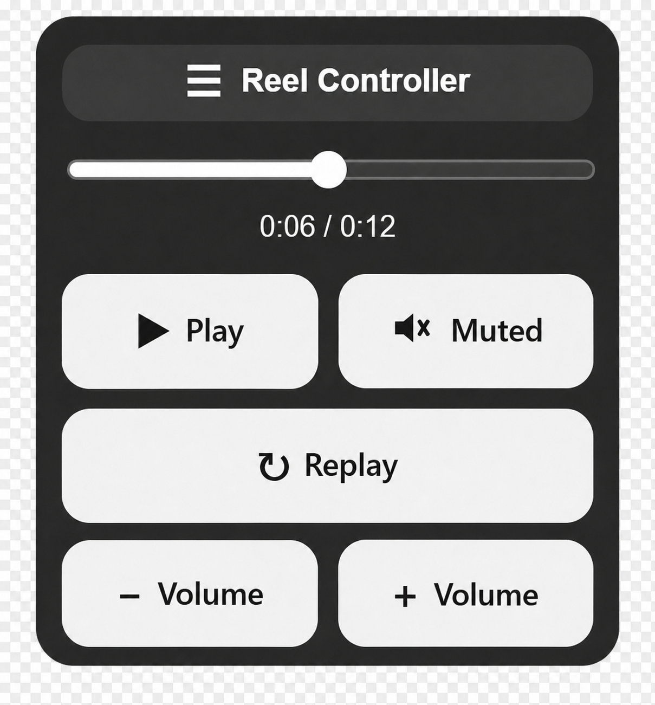

# ReelPlus
A lightweight browser extension inspired by poor browser controls.
Adds a draggable and easy to use control panel for Chrome browser versions of Instagram Reels and TikTok.

## Features

- Play and pause button
- Replay button
- Mute and unmute control
- Volume up and down buttons
- Seek slider with timestamp
- Left arrow and right arrow seeking
- Draggable floating panel
- Saved panel position using local browser storage
- Dynamic play and mute icons

## GUI

## Keyboard Shortcuts

| Key | Action |
|---|---|
| Space | Play or pause |
| M | Mute or unmute |
| R | Replay |
| Left Arrow | Seek backward 1 second (Hold to scan) |
| Right Arrow | Seek forward 1 second (Hold to scan) |
